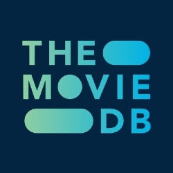

# Markdown File
## MovieSearch v 0.5
***Moviesearch*** is a simple program for looking up movie info by either entering a TMDB-ID or search for titles using TMDB's API.

[MovieSearch repository link](https://github.com/joakim-abra/MovieSearch)  
[My GitHub](https://github.com/joakim-abra)  
#### API provided by The Movie Database
